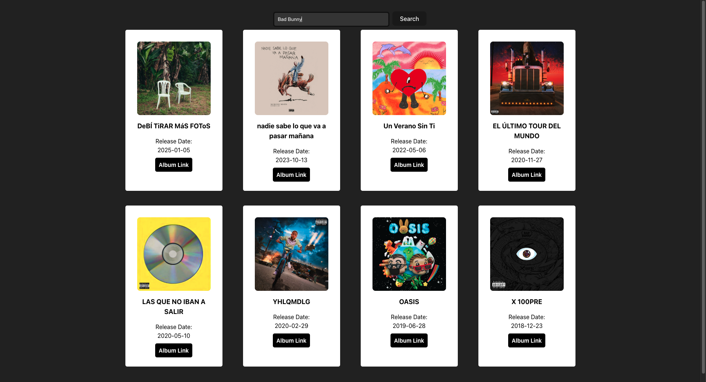

# 🎵 Spotify Artist Album Finder

A sleek web application that allows users to search for an artist and instantly view their albums using the **Spotify Web API**. Built with **React + Vite** and styled using **Bootstrap**, this project demonstrates API integration, async data handling, and responsive UI design.

---

## 📸 Demo

### Initial Search Screen


### Album Results View


---

## 🚀 Features

- 🔍 Search for any artist on Spotify
- 💿 Displays artist albums with:
  - Album artwork
  - Album title
  - Release date
  - Direct Spotify album link
- ⚡ Fast and responsive UI
- 🎨 Clean dark-mode inspired layout

---

## 🛠️ Tech Stack

**Frontend**
- React
- Vite
- JavaScript (ES6+)
- Bootstrap / React-Bootstrap
- CSS

**API**
- Spotify Web API  
  - Client Credentials OAuth Flow
  - Artist search endpoint
  - Albums endpoint

---

## 🧠 How It Works

1. On app load, the app authenticates with Spotify using the **Client Credentials flow**
2. User enters an artist name and clicks **Search**
3. The app:
   - Fetches the artist’s Spotify ID
   - Requests that artist’s albums
4. Albums are rendered dynamically as cards in a responsive grid

---

## 🔐 Environment Variables

Create a `.env` file in the root of the project:

```env
VITE_CLIENT_ID=your_spotify_client_id
VITE_CLIENT_SECRET=your_spotify_client_secret
